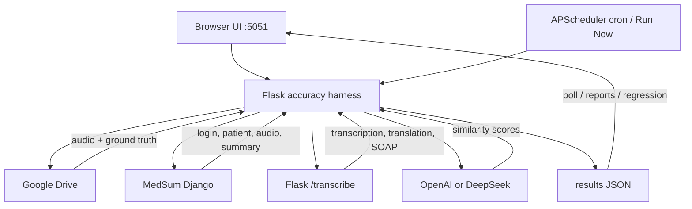
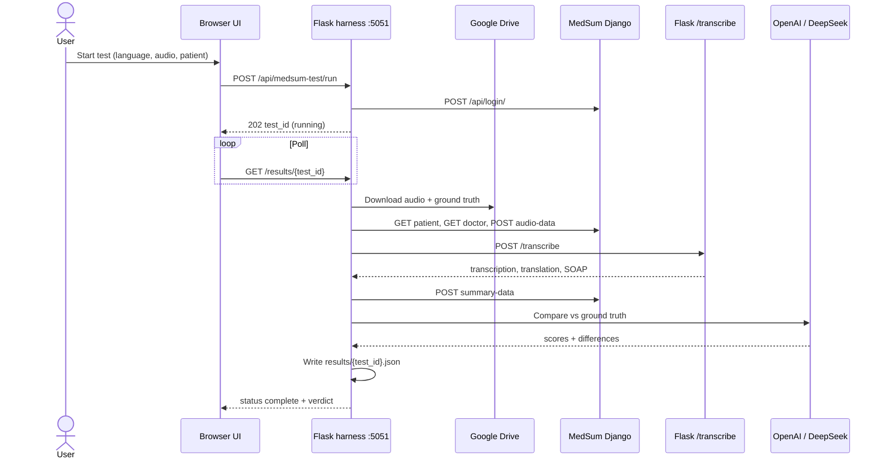

# MedSum Accuracy Testing — System Architecture

**Scope:** Accuracy / regression testing only. Load testing is out of scope.  
**Harness:** Flask app on port **5051** (`medsum_testing`)  
**Config:** `config/medsum_config.yaml`

---

## 1. Purpose

The accuracy harness runs real consultation audio through MedSum (Django + Flask transcribe), then scores the generated transcription, translation, SOAP, and medications against ground-truth files from Google Drive. Results are stored locally as JSON and can optionally be written to Django accuracy-testing tables.

It answers: *For this language and audio fixture, how close is MedSum’s output to the expected clinical text — and did it get worse than last time?*

---

## 2. High-level architecture

```
┌─────────────────┐     ┌─────────────────┐
│  Browser UI     │     │  APScheduler    │
│  (port 5051)    │     │  (cron / now)   │
└────────┬────────┘     └────────┬────────┘
         │                       │
         └──────────┬────────────┘
                    ▼
     ┌──────────────────────────────┐
     │  Flask accuracy harness      │
     │  /api/medsum-test            │
     │  execute_test_run()          │
     └──────────────┬───────────────┘
                    │
     ┌──────────────┼──────────────┬──────────────┐
     ▼              ▼              ▼              ▼
┌──────────┐  ┌──────────┐  ┌──────────┐  ┌──────────┐
│  Drive   │  │  Django  │  │  Flask   │  │ OpenAI / │
│  fixtures│  │  APIs    │  │ /transcribe│ │ DeepSeek │
└──────────┘  └──────────┘  └──────────┘  └──────────┘
                    │
                    ▼
           results/{test_id}.json
           (optional: Django DB)
```

**Copy this Mermaid into [mermaid.live](https://mermaid.live) if you need a diagram image for the doc:**



---

## 3. Components

| Layer | Component | Responsibility |
|---|---|---|
| UI | `medsum_test.html` + `medsum_test.js` | Pick language/audio, doctor, patient; start run; poll results; show scores and reports |
| App | `backend/app.py` | Serves UI, health check, registers blueprints, starts scheduler |
| Orchestrator | `routes/test_runner.py` → `execute_test_run()` | One test case from start to verdict |
| Fixtures | `services/drive_service.py` | List language folders; pair audio to transcript / SOAP / translation GT; download files |
| MedSum client | `services/medsum_api.py` | Login, patient, audio upload, transcribe, save/fetch summary |
| Scoring | `services/ai_comparator.py` | Compare generated output to ground truth via LLM |
| Persistence | `services/result_store.py` | Write/read `results/{test_id}.json` |
| Reports | `services/report_generator.py` | PDF / Excel on demand |
| Scheduler | `services/scheduler_service.py` | Cron or manual “run all” with parallelism cap |
| Config | `config/medsum_config.yaml` | URLs, doctor, Drive folder, LLM keys, template, scheduler |

**HTTP surface (accuracy only)**

| Method | Path | Purpose |
|---|---|---|
| GET | `/` | UI |
| GET | `/api/medsum-test/health` | Health + AI key warning |
| GET | `/api/medsum-test/drive-files` | Ready fixtures from Drive |
| POST | `/api/medsum-test/run` | Single test (returns 202 + test_id) |
| POST | `/api/medsum-test/run-all` | All ready fixtures × doctors × patients |
| GET | `/api/medsum-test/results` | List results |
| GET | `/api/medsum-test/results/{test_id}` | One result (UI polls this) |
| GET | `/api/medsum-test/results/batch/{batch_id}` | Batch rollup |
| GET | `/api/medsum-test/stats` | Dashboard stats |
| GET | `/api/medsum-test/report/{test_id}` | PDF or Excel |
| GET/POST | `/api/medsum-test/schedule` | View / update cron |
| POST | `/api/medsum-test/schedule/run-now` | Trigger scheduled suite now |

---

## 4. End-to-end flow (one test case)

A single run is **asynchronous**. The API returns immediately with `test_id` and `status: running`. Work continues in a background thread. The UI polls the result JSON until status is `complete` or `failed`.

| Step | Action | System | Endpoint / source |
|---|---|---|---|
| 0 | Authenticate doctor (phone + password) → JWT | Django | `POST /api/login/` |
| 1 | Resolve fixture by language + audio filename | Google Drive | Language subfolders under `root_folder_id` |
| 2 | Download audio; optionally transcript, SOAP GT, translation GT | Google Drive | Service account (read-only) |
| 3 | Verify patient exists | Django | `GET /api/patient-data/{id}/` |
| 4 | Fetch doctor name / department / hospital | Django | `GET /api/user/update/{id}/` |
| 5 | Upload audio → `session_id`, `audio_id` | Django | `POST /api/audio-data/` |
| 6 | Transcribe: STT + translation + SOAP LLM | Flask | `POST /transcribe` (base64 audio, SOAP template, language, STT/LLM settings) |
| 7 | Save generated summary | Django | `POST /api/summary-data/` |
| 8 | Fetch saved summary and medication data | Django | `GET /api/summary-data/?session_id=` and `GET /api/audio-data/?session_id=` |
| 9 | Score vs ground truth (and vs previous run) | OpenAI or DeepSeek | `ai_comparator` |
| 10 | Classify verdict; write JSON; optionally POST to Django accuracy-testing | Local disk (+ Django if enabled) | `results/{test_id}.json` |

**Progress steps shown in the UI**

1. Fetching audio from Drive  
2. Uploading audio to Django  
3. Transcribing via Flask  
4. Running AI comparison  

---

## 5. What is compared

| Comparison | Ground truth | Generated | Notes |
|---|---|---|---|
| Transcription (primary) | Drive transcript / `_script` file | Flask `transcription` | Drives `accuracy_score` and pass/fail/review |
| Translation | English: same as transcript. Other languages: `*_translation` / `*_english` file | Flask `debug.translation` | Skipped if either side is missing |
| SOAP | `*_soap.json` / `*_soap.txt` | Flask SOAP fields vs `debug.raw_soap` | Three-way when GT exists: GT vs generated vs raw |
| Medications | — | Flask raw vs generated meds | Structural check, not Drive GT |
| Regression | Previous local result for same language + audio | Current transcription / summary / score | `better` / `worse` / `same` / `na` (±2 points) |

If there is **no transcript file**, the pipeline still runs. Scoring is skipped and the verdict is `complete_no_accuracy`.

---

## 6. Verdict rules

| `final_result` | Meaning |
|---|---|
| **pass** | Transcription comparison exists, severity is not high/critical, similarity ≥ 80 |
| **fail** | Transcription comparison severity is **high** or **critical** |
| **review** | Comparison exists but score is below 80 |
| **complete_no_accuracy** | Run finished; no ground-truth transcript |
| **failed** | Exception during the run |

Passed completions for dashboard counts: `pass` and `complete_no_accuracy`.

---

## 7. How runs are started

| Mode | Trigger | What runs |
|---|---|---|
| Single | UI → `POST /run` | One language + one audio + one patient |
| Run All | UI → `POST /run-all` | Every ready Drive audio × every doctor × that doctor’s patients. Starts are staggered (`run_all_stagger_seconds`, default 3s) |
| Scheduler | Cron in YAML, or `POST /schedule/run-now` | All ready Drive cases using config doctor credentials. Parallelism: `max_parallel_tests` (default 2). Skips an audio if a result was written in the last 60 seconds. File lock so only one process runs the suite |

---

## 8. Google Drive fixture layout

Root folder ID is set in `google_drive.root_folder_id`. Each **subfolder** is one language (`01_Hindi` → Hindi). Audio files are paired to ground truth by stripped filename (e.g. `03_hindi_11.mp3` matches `hindi_11_script.txt`).

```
[Root folder]
├── 01_Hindi/
│   ├── hindi_05min_Cardiology.mp3          ← required (defines the test case)
│   ├── hindi_05min_Cardiology.txt          ← transcription GT (or _script / _transcript / _gt)
│   ├── hindi_05min_Cardiology_soap.json    ← SOAP GT
│   └── hindi_05min_Cardiology_translation.txt
├── 09_English/
│   ├── english_10min_Neurology.mp3
│   └── english_10min_Neurology.txt         ← for English, this is also translation GT
└── Punjabi/
    └── punjabi_08min_Orthopedics.mp3       ← no transcript → run without accuracy scoring
```

Access: Google service account JSON (`credentials/service_account.json`), shared on the Drive folder with Viewer access.

---

## 9. External systems

### 9.1 MedSum Django (`django_base_url`)

Used for identity and persistence of a real session.

- `POST /api/login/` — JWT (`access`)
- `GET /api/user/update/{id}/` — doctor profile
- `GET /api/patient-data/{id}/` — patient must exist
- `POST /api/audio-data/` — stores audio, returns `session_id` + `audio_id`
- `POST /api/summary-data/` — stores transcription + summary
- Optional: `POST /api/accuracy-testing/batches/create/` and `POST /api/accuracy-testing/runs/create/`

Django accuracy rows are written only when `features.save_to_django_db` is true, and only at a **terminal** status (`finished` / `failed` / `skipped`). Local status `complete` is mapped to `finished`.

### 9.2 Flask transcribe (`flask_transcribe_url`)

This is the **system under test**. No JWT. Timeout 300 seconds.

Payload includes: base64 audio, SOAP consult template, `template_id`, language, `llm`, `stt_model`, `translate_model` (from `llm_settings`).

Response includes: `transcription`, translation, SOAP fields, `debug.raw_soap`, and timings (`transcription-time`, `translation-time`, `llm-time`, `total-time`). An LLM error in the body is recorded; the run continues if transcription is present.

### 9.3 Scoring LLMs

Configured under `ai_comparison`. Models: `gpt-4o-mini`, `gpt-4`, `deepseek`. Used only to **compare** MedSum output to ground truth — not to generate the clinical summary.

---

## 10. Persistence

| Store | What | Used for |
|---|---|---|
| `results/{test_id}.json` | Full `TestResult` after every status change | UI polling, reports, previous-run regression, batch rollup when Django is off |
| Django accuracy-testing tables | Terminal run + batch | Server-side history (optional; currently off if `save_to_django_db: false`) |
| PDF / Excel | Generated on download | Sharing a single run |

---

## 11. Sequence (one test)


